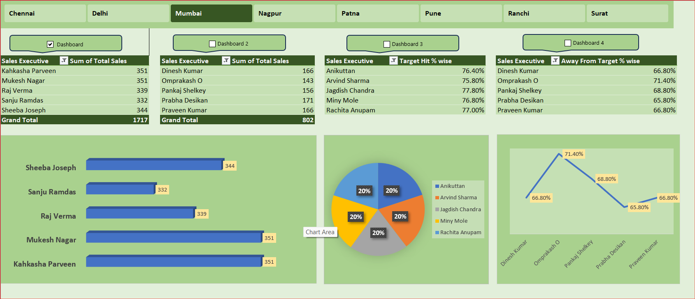

#  Excel Sales Performance Dashboard

##  Project Overview
This project analyzes multi-city sales data using Microsoft Excel and provides business insights through an interactive dashboard.

The dashboard enables management to monitor performance, track target achievement, and identify improvement areas.

##  Business Objectives
- Analyze sales performance across cities
- Measure Target Hit %
- Identify employees away from target
- Track total sales by executive
- Compare regional performance

##  Tools & Techniques Used
- Microsoft Excel (.xlsm)
- Pivot Tables
- Pivot Charts
- Slicers (City-wise filtering)
- Conditional Formatting
- KPI Calculations
- Target vs Achievement Analysis

##  Key KPIs
- Total Sales
- Target Sales
- Target Hit %
- Away From Target %
- Grand Total by City

##  Key Insights
- Nagpur region generated highest total sales.
- Some executives achieved more than 75% of target.
- Certain regions show higher "Away From Target %" indicating improvement opportunity.
- Performance varies significantly across cities.

---

##  Files Included
- sales_Dashboard.xlsm
- dashboard_preview.png

##  Dashboard Preview

This project demonstrates Business Intelligence, KPI tracking, and data-driven decision-making skills.
